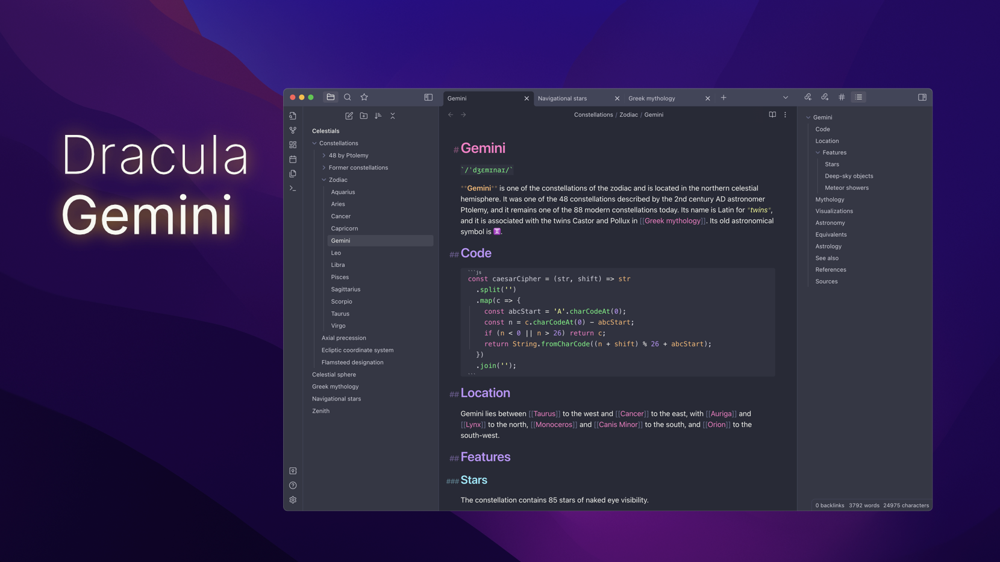
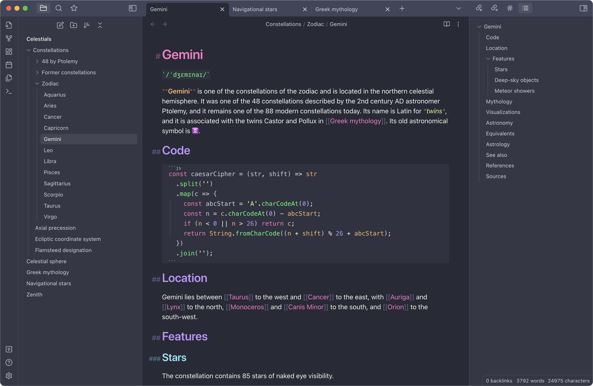
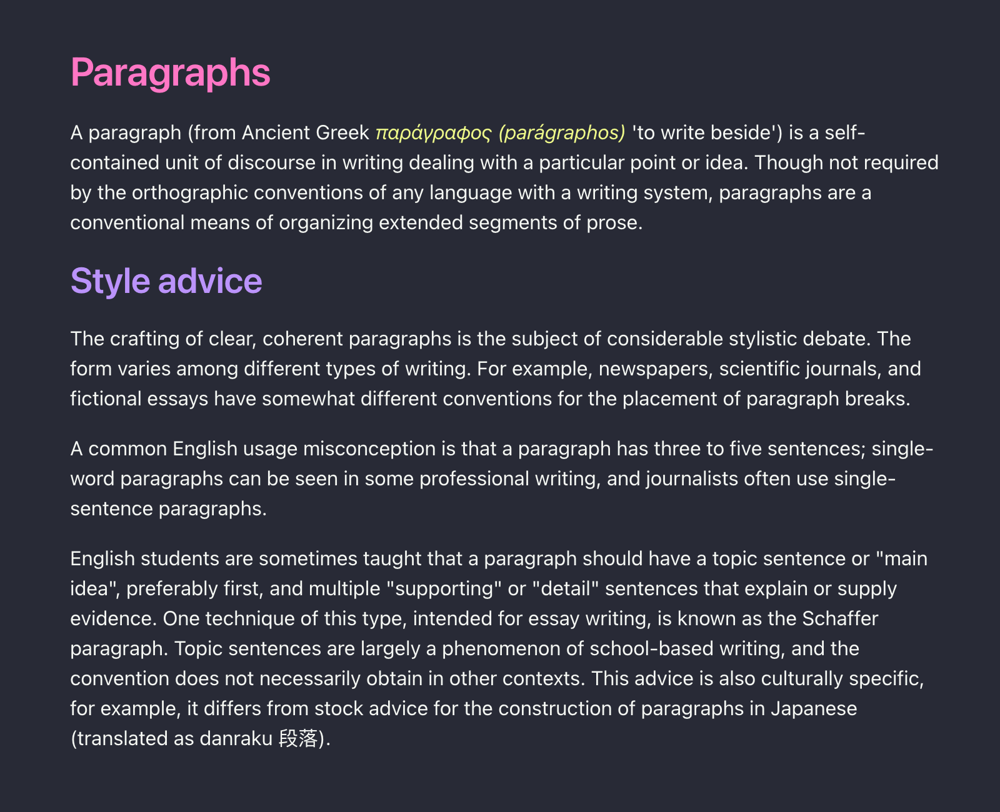
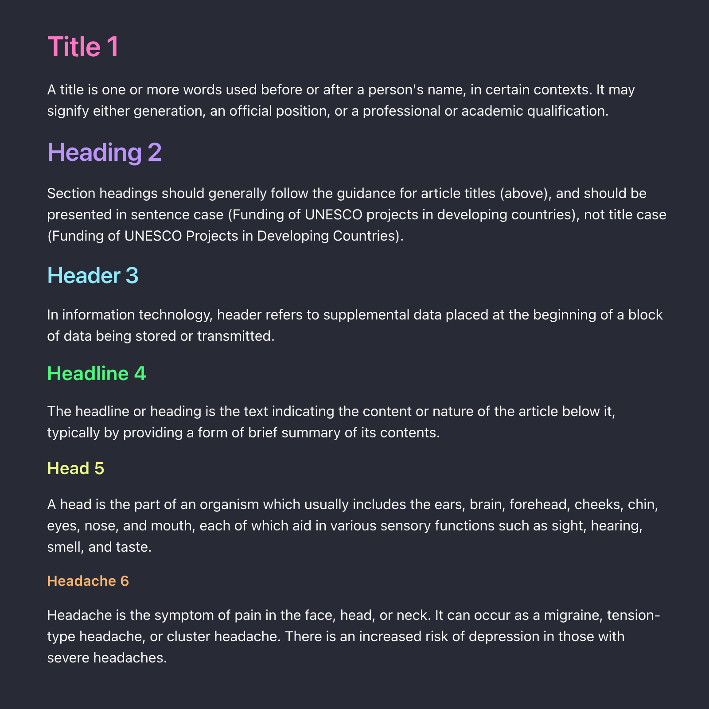
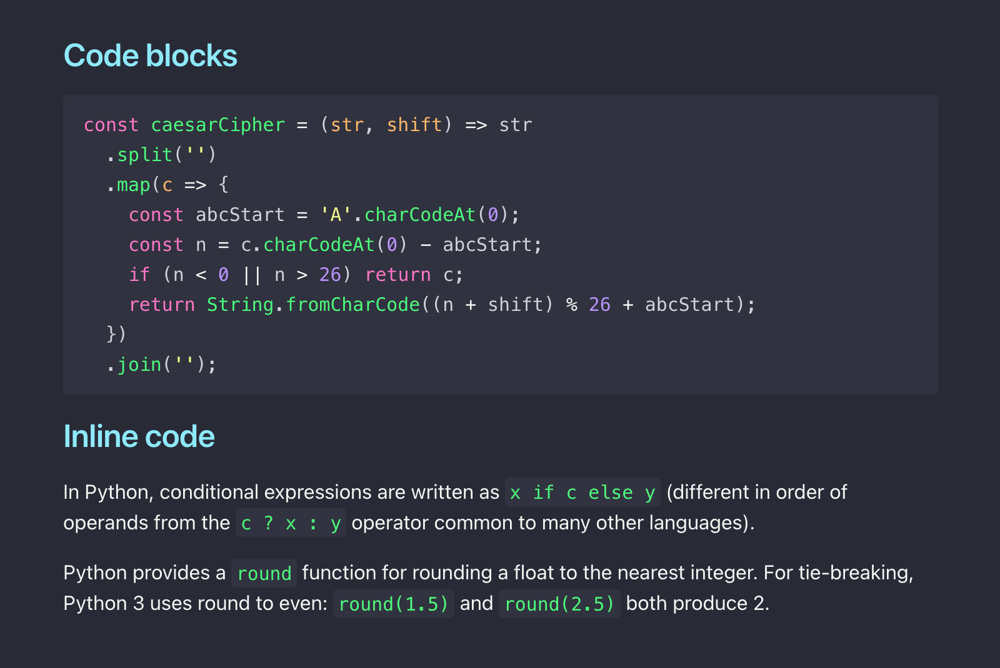
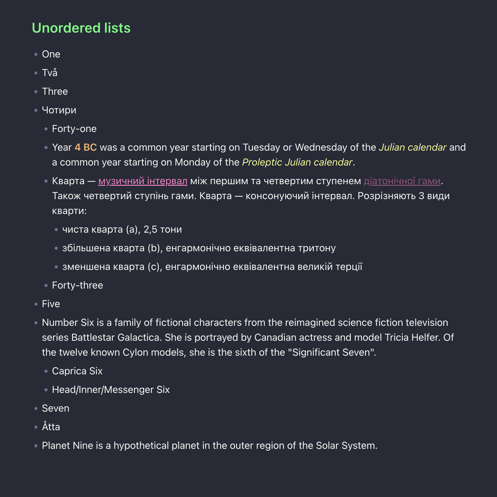
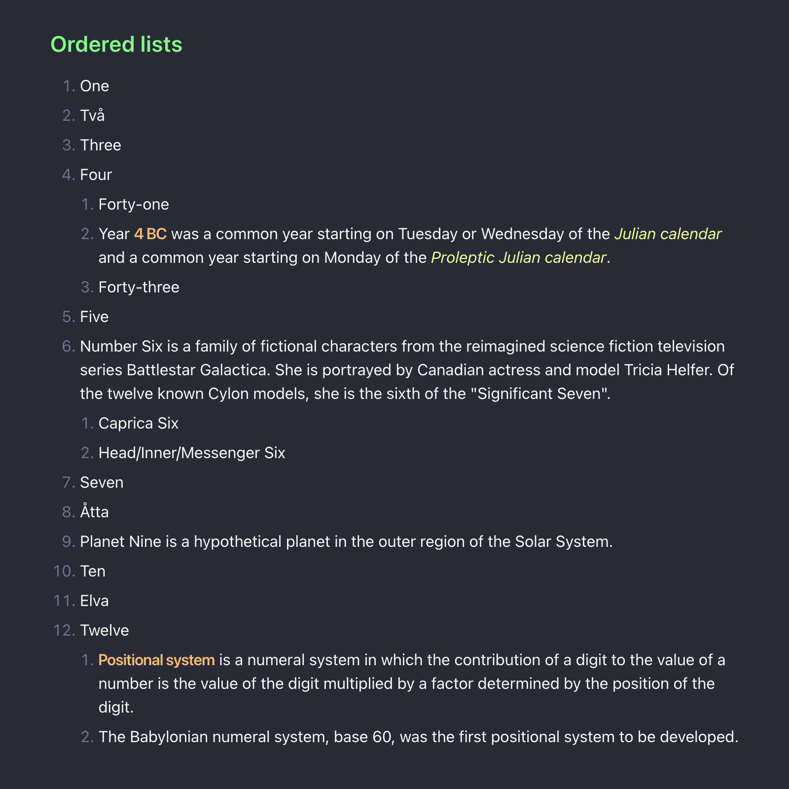
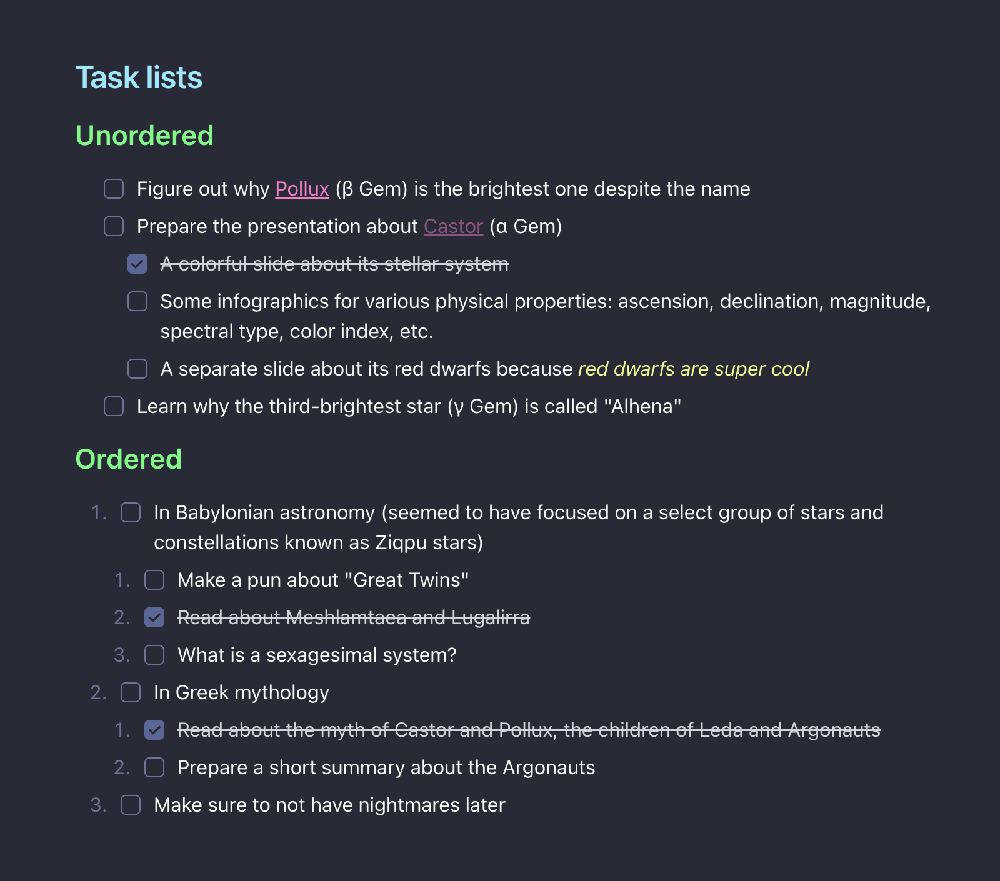
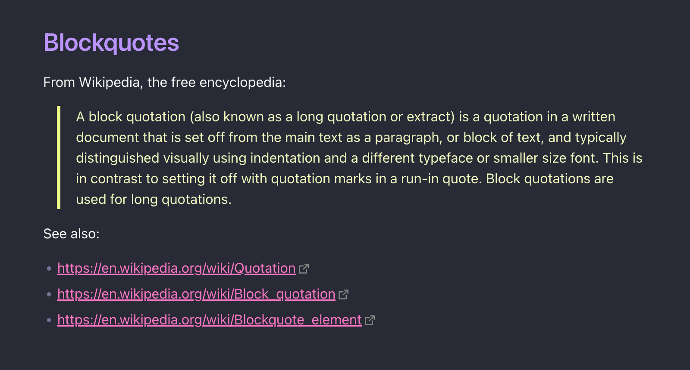

# Dracula Gemini

&nbsp; 

A dark theme for [Obsidian.md](https://obsidian.md/) with [Dracula](https://draculatheme.com/) color palette.

## Why

It started as an experiment. I wanted to make the typography of Source mode look nicer: good spacing between paragraphs, reasonable margins around headers, the little details. I wanted it to look like the Reading view, or at least close enough.

I realize that Live Preview is a great way for many Obsidian users to edit their notes, but I strongly prefer the "raw" experience of Source mode. Navigating the text in Live Preview makes sentences jump back and forth under the cursor (when formatting syntax shows up and hides again), and I find that very distracting during writing. Besides, I like Markdown.

So I wanted all formatting characters clearly visible in the Editing view, for maximum control over the text. At the same time, I wanted it to look as close as possible to the Reading view; meaning that when I press Cmd+E, all the pieces would (mostly) stay in exactly the same place.

### Goals and features

The theme is focused on fine-tuning the editing experience. It is mostly targeted to those old-school folks who prefer using Source mode over Live Preview. Also, some liking for Dracula color palette wouldn't hurt.

It aims to make the Editing view look awesome, implementing:

#### Careful arrangement of text blocks

- Empty lines (spacing between paragraphs) have a height of 1em instead of 1.5em.

  

    
🍿 Paragraphs and spacing

    
  

  
- Header prefixes (`###`) are moved to the text margin.

  

    
🍿 Headers and their formatting

    
  

- Lists, code blocks, quotes, and other elements are adjusted horizontally and vertically to align with the Reading view.

  

    
🍿 Code blocks and inline code

    
  

  

    
🍿 Unordered lists

    
  

  

    
🍿 Ordered lists

    
  

  

    
🍿 Task lists

    
  

  

    
🍿 Blockquotes

    
  

#### Discreet formatting syntax

The theme makes the Markdown syntax parts (e.g., `###` and `>`) less prominent. Header prefixes and bold/italic wrappers are dimmed, code backticks and metadata delimiters are made smaller, et cetera. However, all the characters are still visible and editable.

#### Attention to small(er) things

With attention to every pixel and color, the content must be readable while looking nice.

### Non-goals

For clarity, here are a few specific things intentionally *not* addressed:

#### Full compliance with the Dracula specification

While mostly the theme aims to be spec‐compliant, there are several things deliberately not implemented by [the spec](https://spec.draculatheme.com/): purple-only headers, cyan list bullets, italic blockquotes, et cetera.

#### Changing the UI outside the editor

While the old (pre-v1) Gemini theme also changed the look of the workspace, it's not the case with v1.0+. The new default theme in Obsidian 1.0 turned out to be quite thoughtful, with all the UI elements working really well with each other. That's why the new Gemini only focuses on customizing the core experience, i.e. the text of the note, not the UI around it. Therefore, outside the editor area, the theme only affects base colors.

#### Customizing fonts

Luckily, the default font families and font sizes just happen to work fine (for me, in my OS, with my setup, on my machine). And Obsidian already has the font settings for anyone who prefers changing them. So this theme is not expected to modify fonts.

## Installation

### Obsidian marketplace (recommended)

1. Open **Settings** in Obsidian app.
2. Navigate to **Appearance** tab.
3. Under the **Themes** section, click **Manage** button.
4. Search for "Dracula Gemini" in the Filter.
5. Select the theme in the search results.
6. Click **Install and use**.

### Manual installation

1. Download `theme.css` from this repo.
2. Rename the file to `Dracula Gemini.css`.
3. Move it into `.obsidian/themes` directory inside your vault.
4. Open **Settings** in Obsidian app.
5. Navigate to **Appearance** tab.
7. Under the **Themes** section, select "Dracula Gemini" in the dropdown menu.
